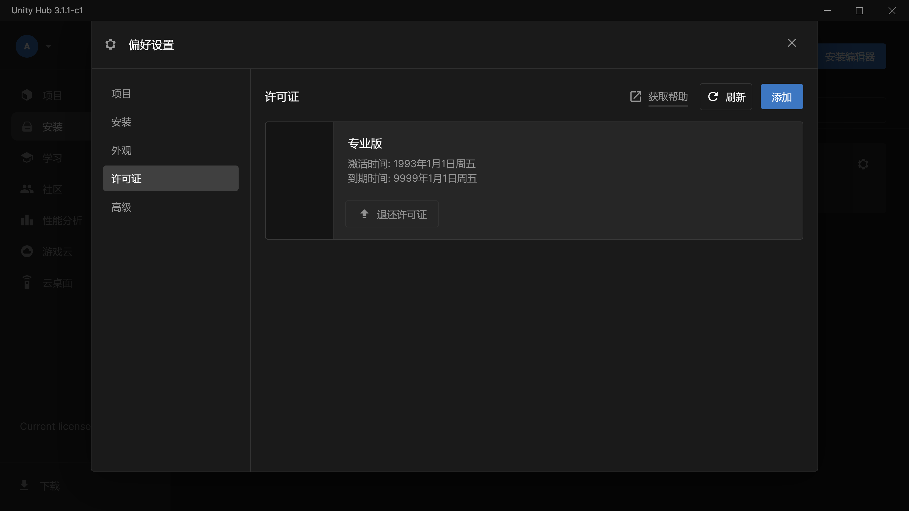
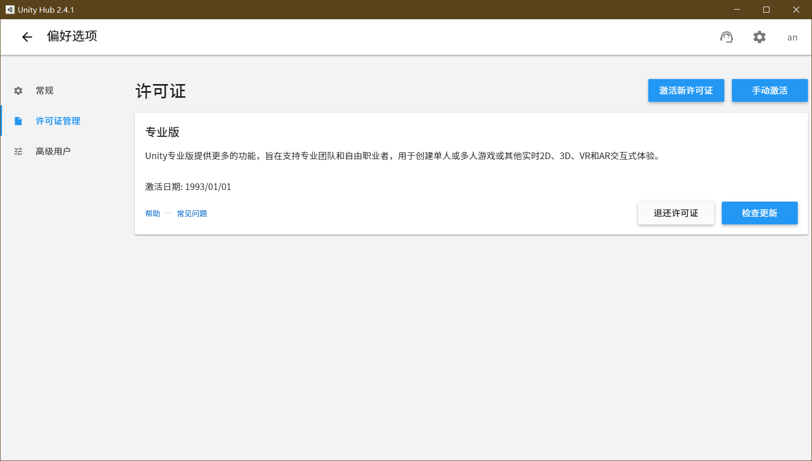

# CrackUnityHub

# **当前仓库已不再维护，请前往这个仓库 [UniHacker](https://github.com/tylearymf/UniHacker)**


### 效果






### 操作方法


> 方案1
>> 下载 Release 中的 工具压缩包，解压得到 CrackHub.exe 文件，然后 双击执行exe 即可。

> 方案2
>> 自己手动修改，请搭建 Node.js 和 asar 环境，然后按照下面的修改逻辑修改即可。


### UnityHub2.x 代码修改逻辑


1. 先解包：```asar extract app.asar app```

2. 
    ```javascript
    修改 build\services\licenseService\licenseClient.js 中的 getLicenseInfo 方法为如下代码：
    	getLicenseInfo(callback) {
            licenseInfo.activated = true;
            licenseInfo.flow = licenseCore.licenseKinds.PRO;
            licenseInfo.label = licenseCore.licenseKinds.PRO;
            licenseInfo.offlineDisabled = false;
            licenseInfo.transactionId = licenseCore.getTransactionId();
            licenseInfo.startDate = new Date('1993-01-01T08:00:00.000Z');
            licenseInfo.stopDate = licenseCore.getInfinityDate();
            licenseInfo.displayedStopDate = false;
            licenseInfo.canExpire = false;
            const licenseInfoString = JSON.stringify(licenseInfo);
            if (callback !== undefined) {
                callback(undefined, licenseInfoString);
            }
            return Promise.resolve(licenseInfoString);
        }
    ```

3. ```javascript
   修改 build\services\localAuth\auth.js 中的 getDefaultUserInfo 方法为如下代码：
   	static getDefaultUserInfo() {
           return {
               accessToken: '',
               displayName: 'anonymous',
               organizationForeignKeys: '',
               primaryOrg: '',
               userId: 'anonymous',
               name: 'anonymous',
               valid: false,
               whitelisted: true
           };
       }
   ```

4. 最后打包即可：```asar pack app app.asar```

### UnityHub3.x 代码修改逻辑

1. 直接看代码去
